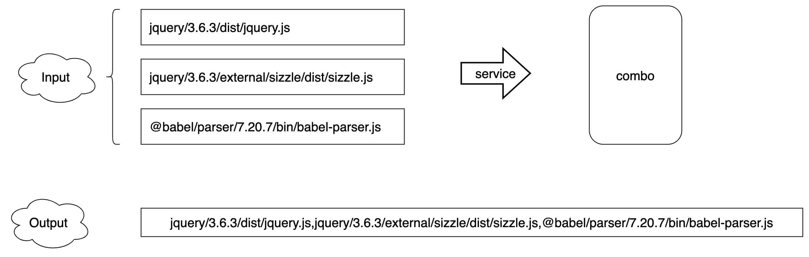
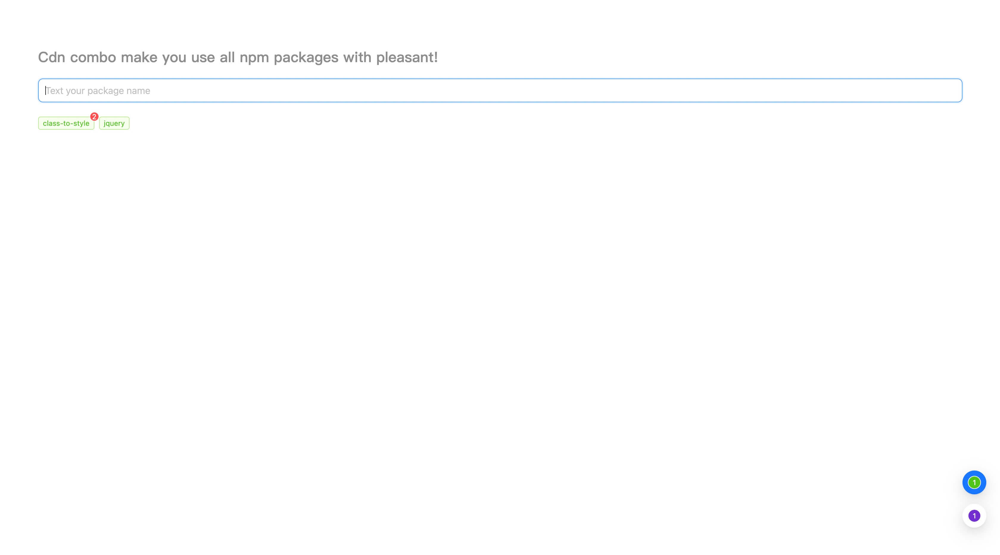
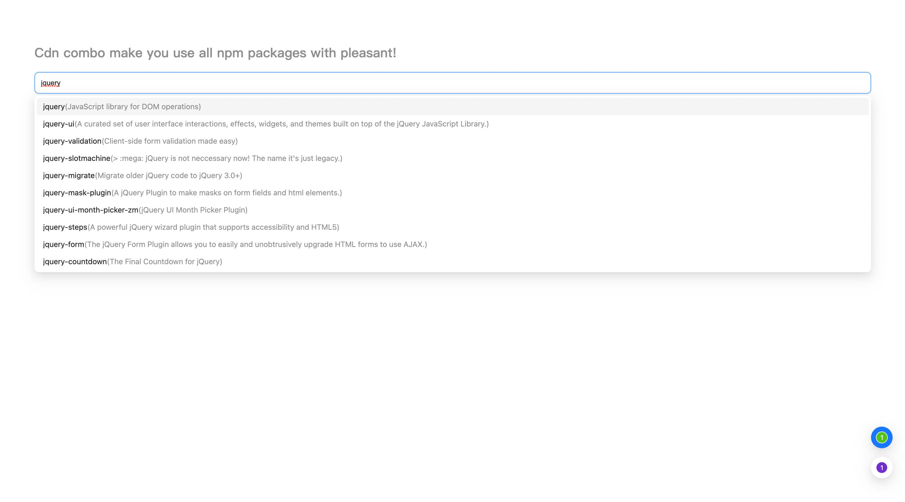
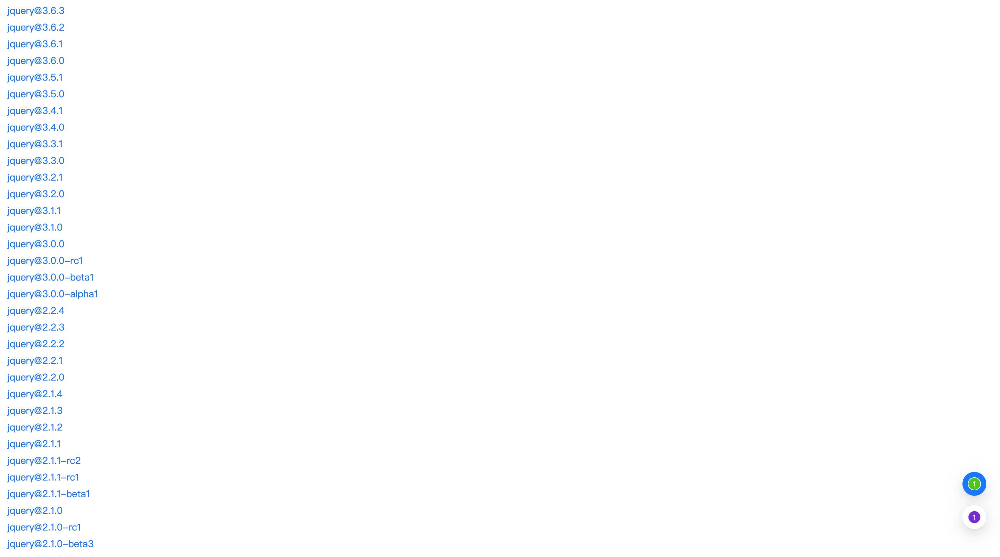
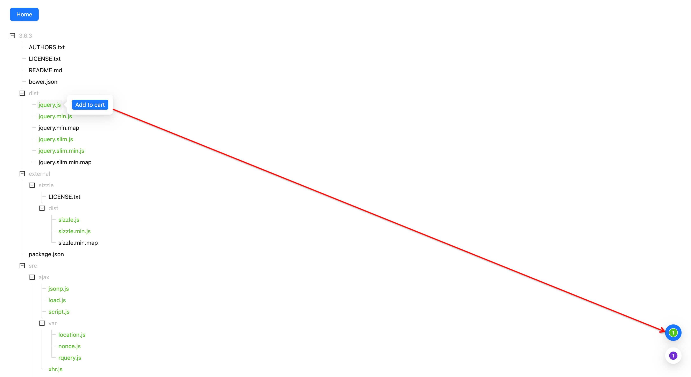
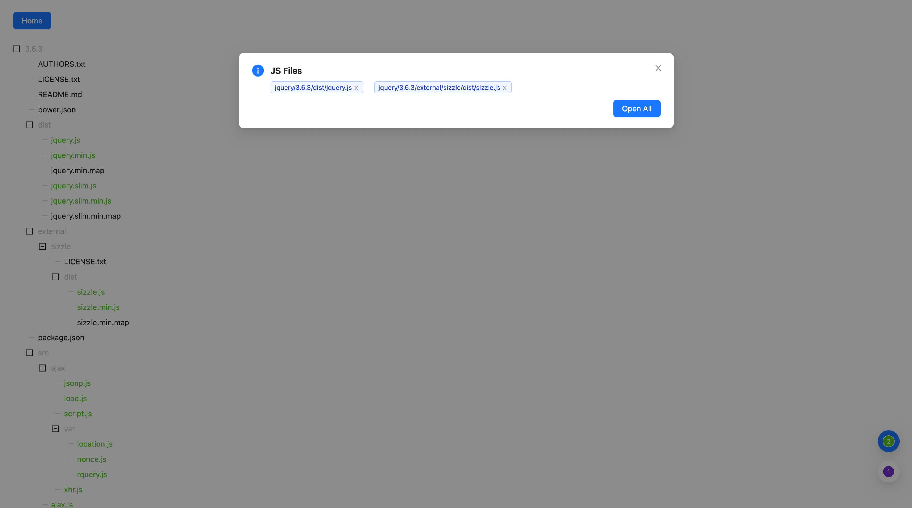
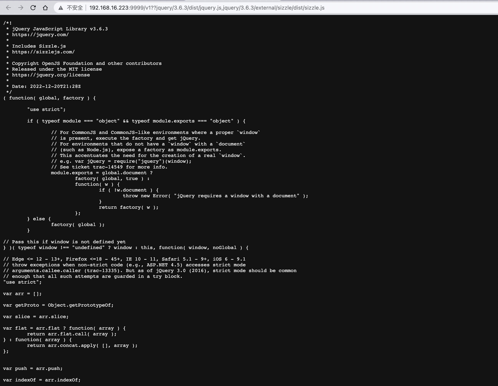

# Cdn-combo Documentation


## What is cdn-combo?
> CDN-combo is a technology that combines files together for client-side use. It originates from two words: CDN and combo. Combo refers to a combination move in games, and CDN-combo refers to combining the required resources together for client-side use. This technology has the following characteristics:
> 1. Saves the number of HTTP requests, improving page load speed.
> 2. Connects to CDN, avoiding local installation, and improving local development efficiency.
> 3. Additional functionality is improved, making it easy to quickly search and reference resource packages.
>
> This technology is commonly used in front-end optimization to improve website access speed and reduce server pressure.
> 



## Screen Shot
1. Home Page

2. Search Box

3. Show Package Versions

4. Show Package Files

5. Show Files In Cart

6. Combo Files



## What the architecture like ?
### example http request
```
/v1??axios/1.1.2/dist/esm/axios.min.js,bootstrap/5.3.0-alpha1/dist/js/bootstrap.bundle.js
```

#### explain `/v1`
> `/v1` is the version of cdn-combo, it is used to distinguish the version of cdn-combo. If you want to upgrade the version of cdn-combo, you can change the version number of the url, In this way, you can use the new version of cdn-combo without affecting the old version of cdn-combo.


#### explain `??`
> `??` is the separator of cdn-combo, it is used to distinguish the file list and the version of cdn-combo. If you want to upgrade the version of cdn-combo, you can change the version number of the url, In this way, you can use the new version of cdn-combo without affecting the old version of cdn-combo.


#### explain `axios/1.1.2/dist/esm/axios.min.js,bootstrap/5.3.0-alpha1/dist/js/bootstrap.bundle.js`
> `axios/1.1.2/dist/esm/axios.min.js,bootstrap/5.3.0-alpha1/dist/js/bootstrap.bundle.js` is the file list, it is used to distinguish the file list. `axios` is the name of the package, `1.1.2` is the version of the package, `dist/esm/axios.min.js` is the path of the file in the package. So we define the distinguished each file in the list by `[packageName]/[packageVersion]/[filePath]`.


### Deploy architecture
> CDN-combo server => CDN server => client


### local development
1. start cdn-combo server
```
node server/server-index.js
```
2. start cdn-combo client
```
yarn dev
```


### Build and RUN
```
git clone https://github.com/tsaowe/cdn-combo.git
cd cdn-combo
docker build -t cdn-combo-image .
# run with name cdn-combo-container host port 9999 inner port 4000
docker run -d --name cdn-combo-container -p 9999:4000 cdn-combo-image
```

### TODO
- [ ] add log for server
- [ ] add volume mount for server
- [ ] add multi core ??? single core may be not enough
- [ ] Documentation complete
